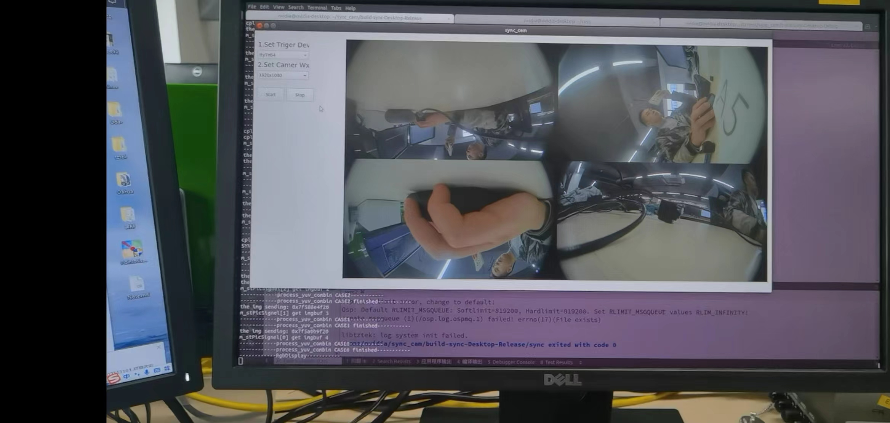

# sync_cam

#### Description

Base on Qt display mulity camer demo

#### Software Architecture
Typically is based on aarch64

#### Installation

1.Download the file and open in Qt 5.x
2.Configure your path
3.Build this porject && make -j in build-path
4.just run

#### Feature

1.  Libyuv to transform different type
2.  Cuda convert yuv -> rgb
3.  V4l2 control camera

#### Contribution

Ernest
